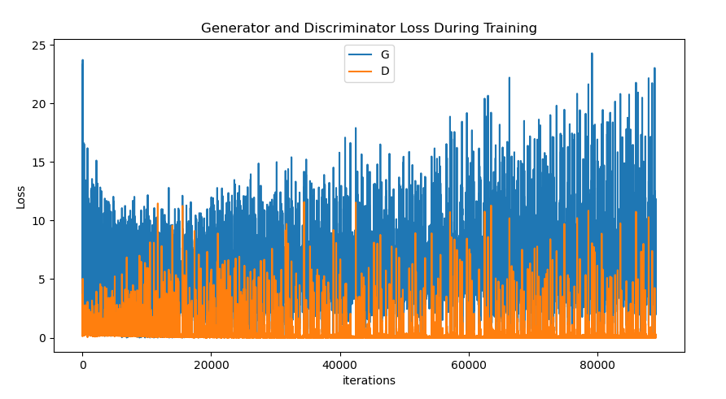

# WaifuNets
Using GAN to generate new waifu characters

### Usage

To run the experiment, 

```bash
Change directory according to your data folder and tune batch-size, epochs, etc accordingly
$ python script.py
```

### Results



### Dataset

Anime-style images  of 125 tags are collected from [danbooru.donmai.us](http://danbooru.donmai.us/).

### Point I Learned
1. GANs are very difficult to train and get satisfying results. This was my very first approach where I used PyTorch just after learning it with very little knowledge on workings of GAN. I will come back later after I have throughly studied it.
2. Use differnet input and generate resolution (64x64 vs 96x96 vs 128x128), there seems no obvious difference during training, the generated images are also very similar.
3. Simply add FC layers causes problems. Originally it caused huge errors dur=e to fact that I'm still struggling in shaping tensors and setting their initializing weights for FC Layers
4. Add noise to D's inputs and labels helps stablize training.
5. Binray Noise as G's input amazingly works, but the images are not as good as those with Gaussian Noise.

### Others Cool GANs
This project is heavily influenced by [chainer-DCGAN](https://github.com/mattya/chainer-DCGAN) and [IllustrationGAN](https://github.com/tdrussell/IllustrationGAN), the codes are mostly borrowed from [PyTorch DCGAN example](https://github.com/pytorch/examples/tree/master/dcgan), thanks the authors for the clean codes.
